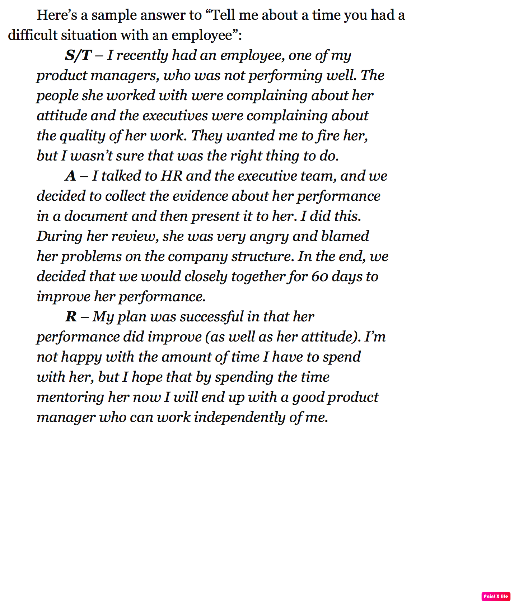

## Question 1. 

- **Tell me something about yourself.**

**Answer** 

Hi .., Myself Neeraj, Having 15+ year of industry experience, I started my carrier as a developer but now I am managing people for past 7 years. Most of my expeirnece in is Telco and finance. Currently I am working with Relience Jio as enginerring Manager. I have involved in the delivery of two very critical project UPI and Mobile banking as part of Myjio. I also played an architect role while delivering the solution. 

I have good exposer in cross funtional stack holder management, defining project scope and translating them to the funcational requirments for further developmet. 

I am self driven person who believes in mentoring and empowering people. I am not afraid of taking risk and innovate.  

## Question 2.

- **Why Amazon.**

**Answer** 

Amazon is the  most customer centric company and goes extra mile for cutsomer satisfaction. While working with jio I have learned how to strive for excellence and improve our service to meet end customer need. If I have the oppurtunity, I will contribute to achive higher custiomer satisfaction. 

Another aspect I can contribute in Amazon success story with my ability to mentor and empower team and further learn and innovate. 

## Question 3

- **What is your weekneess?**

**Answer** 

I had a lot of thoughts which I could not put into words due to lack of sufficient vocabulary or scared of giving a false impression or for the fear of not being able to communicate "exactly" how I framed it in my mind.

## Quetsion 4

- **what is your daily routine.**

**Answer** 

Strat my day with the opertaion team call to check if there any issue in production which needs to be taken care on priorpties. Go over the metrics and identify if there is any anomaly in the production.
Than I have usual call with the my devloper to tarck the ongoing spring task. Identify the issue/blocker where my intevention is needed. 
Than I have another call with the whole team which includes my tester/ L3 support/ Product team is involved. Identify the issue/blocker where my intevention is needed.
I start working on the task for the day. 

## Question 4

- **Tell me about of time when you had a difficult situation with an employee.**

## Question 5

- **Who was your most difficult customer?** or
- **Tell me about a time when you went above and beyond the call of duty for a customer.  Why did you take the action you did?  What was the outcome?**

**Answer** 
MTN camerroon was the best example where we were deploying the payment gateway for their wifi on demand services. They had a genuine problem where around midnight there were serge in the payment failures and consumer were impacted. They reported the issue to my opeartion team which further dealyed the resolution since team shugged it off saying that issue was at the bakend system and API SLA is breaching. Than issue escalated and came to me. I looked into the problem and relaized that it might not be our issue but certianly the platform as a whole. When we debug the problem we realized that OCS(Ericssion server) was breaching the SLA but issue was not with the Ericssion but with the network latency. Later it was identified thet nwtwork were congested since DB backup between two sites and using the same network. 

## Question 6 (co)

- **Give me an example of a time when you did not meet a client’s expectation. What happened, and how did you attempt to rectify the situation?** or 
- **Tell the story of the last time you had to apologize to someone.**

**Answer**

This is the recent incident I had with one of the VP in my company and he was tring to add kotak account in the UPI but it was not working. So i asked him if he can try some other bank and he did and it worked. After I came back home and my wife has account with kotak. So I onboarded her and tried add kotak bank accountand it failed. This time I asked my operation team to analyse the logs and identify the problem and found that NPCI is not giving the data in proper format. Since we can not test this in lower enviormnent, all we had to handle the scenerio in production. 

## Question 7 (co)

- **In your opinion, what is the most effective way to evaluate the quality of your product or service to your internal /external customer?  Give an example of a time when you used these measures to make a decision.** 

**Answer** 

TBD

## Question 8 (co)

- **What changes have you implemented in your current department to meet the needs of your customers?  What has been the result?**

**Answer**
When we launched UPI and finance service as part myjio for CUG customer, we began with the android and ios native development. But the time to production was really high if the bug fixes is require at the client side. Myjio Playstore push require roughly 3 weeks. So I decided that some of the banking feature we can move to web instead of native. Not only this isgnificantly reduced our time to prodution but also the man power which was for android and ios. 

**Another Answer**

While In alpeo and working with the sales team, I realized that most of prospect were tier 2 and tier 3 with small capex to start the bussines. These customer can not sfford bare metal deployemnt and onsite engineer cost. So I took it on myself to build and deploy soution on AWS and integrate with On primes componenet. This helped rcomplany two ways. first we were able to save the server cost and second we decued to onsite engineer cost significanly. The best outcome to we were able to traget customer with smaller capex which was not the scenerio earlier. 

## Question 9 (co)

- **Tell me about a time a customer wanted one thing, but you felt they needed something else.  How did you approach the situation, what were your actions and what was the end result?**

**Answer** 
This is the inceident when my product team came to me where thay want to use MyJio UPI payment option while performing the recharge option. Issue was that if you on the recharge page and send a collect request to jio id id exist. we could do it but the problem was if customer move from rechrage to UPI page than there was no return path. 

What I propsed to use the pay feature instaed of collect, after reacharge amount is selected and customer decided to make payment than lets open the send  money page with amount VPA pre popuulated. This made customer journey really smooth. No switching back and fourth and you complete the payment.

## Question 10 (ownership)

- **Tell me about an initiative you undertook because you saw that it could benefit the whole company or your customers, but wasn’t within any group’s individual responsibility so nothing was being done.**

**Answer** 
While In alpeo and working with the sales team, I realized that most of prospect were tier 2 and tier 3 with small capex to start the bussines. These customer can not sfford bare metal deployemnt and onsite engineer cost. So I took it on myself to build and deploy soution on AWS and integrate with On primes componenet. This helped rcomplany two ways. first we were able to save the server cost and second we decued to onsite engineer cost significanly. The best outcome to we were able to traget customer with smaller capex which was not the scenerio earlier. 

## Question 11 (ownership)

-	**How do you ensure your team stays connected to the company vision and the bigger picture?  Give an example of when you felt a team or individual goal was in conflict with the company vision.  What did you do?**

**Answer** 

TBD

## Question 12 (Invent and simplify)

- **How do you draw new thinking and innovation out of your team? Give an example of how your approach led to a specific innovation.**
- **Tell me about a time when you have enabled your team/ a team member to implement a significant change or improvement.**

**Answer** 

When we fully migrated from molethic to microservices, my operation team had a challenge to track a complete end to end session request. Like eralier thay had to traverse the multiple log files to get the user session logs. This was causing  a significant delay in the debigging. To overcome this issue Team gave them an automate script to find session logs. But that was not somethign I was not very keen and tring for the better solution. So I did my research and deplyed Kafka/Elastic/Kibana stack for log analysis. After which we invent and designed lot of other metrics for monitoring.

**Another Answer** 

This is the inceident when my product team came to me where thay want to use MyJio UPI payment option while performing the recharge option. Issue was that if you on the recharge page and send a collect request to jio id id exist. we could do it but the problem was if customer move from rechrage to UPI page than there was no return path. 

What I propsed to use the pay feature instaed of collect, after reacharge amount is selected and customer decided to make payment than lets open the send  money page with amount VPA pre popuulated. This made customer journey really smooth. No switching back and fourth and you complete the payment.

## Question 13 (Are right Alot)

- **Tell me about your failure/mistake/ error in judgement.**

**Answer** 

Three years back when I joined Jio, I have asssigned a very critical feature which need to go in production. In Jio we have three envoirment , SIT/Pre prod and Prod. as SDM, it was my resposility to get the QA signoff and create a realea request for SIT/PP which I did. Now when I raised the Prod Rlease request, I have asked to provide the security signoff as well. As a first timer I was not aware about the infosec signoff is alos needed. Due this mistake We have a week but I learned my lesson and did not repeated the same mistake. 

## Question 14 (Are right Alot)

- **Tell me a time when you disagree with the boss**

**Answer**

When we aere doing the designing for Jiomart with myjio and I want to leverage exiting authentication using Oauth token but My boss has different approach where he was suggesting to have a encrypted JWT token stored in device which can be used for authentication. ofcource his approach was to save few http calls but compromising the security. We had a meeting and he recejcted the idea of using OAuth. So I decided not to interupt him in meeting and decided to write one email stating what is risk if deceided to have JMT token. I explained the JWT must only use to encrypt transit data but should be subsititued for authentication. How the token can be used for identify theft. 

Another factor which we need to consider about rotation of secret keys being shared with all other systems. If any of the backend key is compromised than there is no quick way to recover. In such scenario new keys need to be generated and given to the backend team and whole process require source code level changes to accommodate new keys. 

I also provide the approcal I was suggesting with the detailed call flow. And he agrred with what I was saying. 

## Question 15 (Are right Alot)

-	**Tell me about a business model decision or key technology decision or other important strategic decision you had to make for which there was not enough data or benchmarks.  In the absence of all the data, what guided your choice and how did you make the call? (follow up with the alternatives considered and how/why they were ruled out in favor of the path taken, what was the risk mitigation strategy? Outcome?  Ask for another example and potentially a third until you are sure this is a pattern and not a one off).**

-	**What are the top strategic issues you’ve had to face in your current role?  What decisions did you end up making?**

**Answer**

While In alpeo and working with the sales team, I realized that most of prospect were tier 2 and tier 3 with small capex to start the bussines. These customer can not sfford bare metal deployemnt and onsite engineer cost. So I took it on myself to build and deploy soution on AWS and integrate with On primeses componenet. I didnt have any data point at that time but I strongly beleived that if I solve this problem than we will have better results in sales. 

This helped complany two ways. first we were able to save the server cost and second we decued to onsite engineer cost significanly. The best outcome to we were able to traget customer with smaller capex which was not the scenerio earlier. 

## Question 15 (learn and innovate)

- **How do you draw new thinking and innovation out of your team? Give an example of how your approach led to a specific innovation.** 
- **Tell me about a time when you have enabled your team/ a team member to implement a significant change or improvement.** 

**Answer**

There are few things which I enforce my team to learn and inovate. 

30 minute of weekly linked learning every week. 
Every friday we have show & tell session where team need to prepare and present something new which they learn in the week.
Recently we were exploring elastic search engine we got the idea to build the serch bar feature in myjio. Currently myjio is a super app and having multiple mini apps but thesearch feature was not consolidated. We are in the process of deliving search bar where it will work as universal search and open the miniapp based the search tag. 

## Question 16 (Hire and develop Best)

- **Tell me about your hiring process when you are hiring key positions such as direct reports.  Where do you go for talent?  What resources do you employ?  What are the steps in the process?  What traits do you seek that will tell you the candidate will be successful on the team apart from the obvious hard skills?  [probe on how they assess specific things in an interview, such as integrity, who does the references?  Do they do them?  How do they use them?}**

**Answer**
First thing I do is to create a well strcutured job descrition and year the experince. See if someone can be promoted internally and hire with smaller experience.  
Look for the somone you know with whom you have worked and willling to take it. 
Ask for the refferal from who is turned out to be very good hire. 
While screening resumes, look for the person who is outperoforming their current role. Say a developer is also doing the designing  or a lead is involved in system architecture. 
Candiadtes are better if they are not switching jobs very freqyently. 
Conduct written screening for the key skill. 
Spend ample time with the candidates when they are onsite. Verify waht is written is resume is correct to check the candidate integritty.
Ask your peer/Manager review before hiring the candidate 

## Question 17 (Hire and develop Best)

- **Tell me about someone that you hired that you thought was better than you in a number of areas.  How did you add value to that person?** 
- **Give me an example of someone who was promoted one or two levels up in the organization – not just because they were a star who would naturally rise, but due to your development/coaching efforts.**

- Tell me about a time when you had a low performing individual on your team.  How did you deliver feedback to this person?  Did their performance improve or did they leave the organization?  (Manager)
- 

