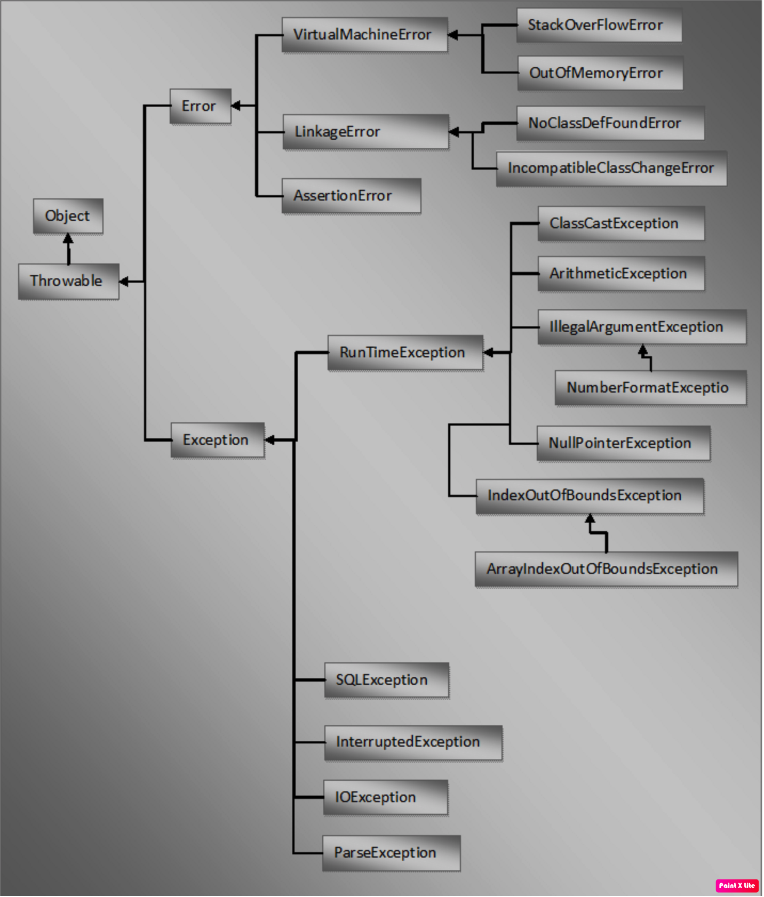

## Point to Rememeber

## 1. java.lang.Throwable is the super class of all errors and exceptions in java. Throwable class extends java.lang.Object class. It has two sub classes.
- java.lang.Error
- java.lang.Exception

### 2. java.lang.Error is the super class for all types of errors in java.

- java.lang.VirtualMachineError : The most common **virtualMachineErrors** are **StackOverFlowError** and **OutOfMemoryError**.
- java.lang.AssertionError
- java.lang.LinkageError  : The common LinkageError are **NoClassDefFoundError** and subclasses of IncompatibleClassChangeError. The most frequent IncompatibleClassChangeErrors are  NoSuchMethodError, NoSuchFieldError, AbstractMethodError, IllegalAccessError and InstantiationError.

### 3. java.lang.Exception is the super class for all types of Exceptions in java. All sub classes of Exception class except sub classes of RunTimeException are checked type of exceptions. 

#### 3.1 All sub classes of RunTimeException are unchecked type of exceptions. i.e They occur during run time only. Some common RunTimeException are ArithmeticException, NumberFormatException, NullPointerException, ArrayIndexOutOfBoundsException and ClassCastException.

## Hierarchy Flow

